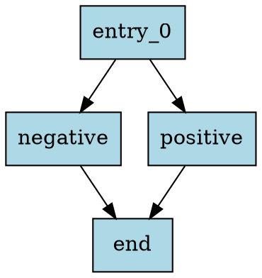

# Control Flow Graph (CFG) Implementation

This implementation provides a complete Control Flow Graph builder for IR (Intermediate Representation) programs.

## Features

- **Basic Block Identification**: Automatically identifies basic blocks from IR instructions
- **Control Flow Analysis**: Analyzes goto, branch, and return instructions to build edges
- **Multiple Output Formats**: Text output and DOT format for visualization
- **Comprehensive Testing**: Full test suite covering various control flow patterns

## Components

### Data Structures

- **`BasicBlock`**: Represents a basic block with instructions and control flow edges
- **`ControlFlowGraph`**: Contains all basic blocks and their relationships
- **`CFGBuilder`**: Static class for building and analyzing CFGs

### Key Methods

- `CFGBuilder::buildCFG(function)`: Builds CFG from an IR function
- `CFGBuilder::printCFG(cfg, stream)`: Prints CFG in human-readable text format
- `CFGBuilder::printCFGDot(cfg, stream)`: Outputs CFG in DOT format for visualization

## Usage

### Building the CFG Library

```bash
cd materials/cpp
mkdir -p build && cd build
cmake .. && make
```

### Running CFG Tests

```bash
chmod +x run_cfg_tests.sh
./run_cfg_tests.sh
```

### Using the CFG Demo

```bash
# Build the demo
g++ -std=c++17 -I../include ../examples/cfg_demo.cpp ./libircpp.a -o cfg_demo

# Generate CFG for an IR file
./cfg_demo ../../example/example.ir output.dot

# Visualize the CFG (requires Graphviz)
dot -Tpng output.dot -o output.png
```

### Programmatic Usage

```cpp
#include "ir.hpp"

// Parse IR file
IRReader reader;
IRProgram program = reader.parseIRFile("example.ir");

// Build CFG for each function
for (const auto& function : program.functions) {
    ControlFlowGraph cfg = CFGBuilder::buildCFG(*function);
    
    // Print CFG
    CFGBuilder::printCFG(cfg, std::cout);
    
    // Generate DOT file
    std::ofstream dotFile("output.dot");
    CFGBuilder::printCFGDot(cfg, dotFile);
}
```

## CFG Construction Algorithm

1. **Basic Block Identification**:
   - Labels start new basic blocks
   - Control flow instructions (goto, branches, return) end basic blocks
   - Sequential instructions are grouped into the same block

2. **Edge Construction**:
   - `goto` instructions create edges to target labels
   - Branch instructions create edges to both target and fall-through
   - Sequential blocks are connected by fall-through edges
   - `return` instructions mark exit blocks

3. **Graph Properties**:
   - Entry block: First basic block in the function
   - Exit blocks: Blocks ending with return instructions
   - Predecessors/Successors: Bidirectional edge information

## Test Cases

The test suite covers:

- **Simple CFG**: Basic if-else control flow
- **Loop CFG**: Programs with loops and back edges
- **Complex CFG**: Multiple branches and control flow paths
- **Real IR Files**: Fibonacci, square root, and quicksort programs
- **Output Formats**: Text and DOT format generation

## Example Output

### Text Format
```
=== Control Flow Graph for function ===
Entry block: entry_0
Exit blocks: end

Block: entry_0
  Predecessors: 
  Successors: negative, positive
  Instructions:
    callr, x, geti
    brlt, negative, x, 0
    brgt, positive, x, 0
    assign, z, 0
    goto, end
```

### DOT Format


## Visualization

To create visual representations of CFGs:

1. Generate DOT file: `./cfg_demo input.ir output.dot`
2. Convert to image: `dot -Tpng output.dot -o output.png`
3. View the image to see the control flow graph

This is particularly useful for:
- Understanding program structure
- Debugging control flow issues
- Optimizing program performance
- Educational purposes
